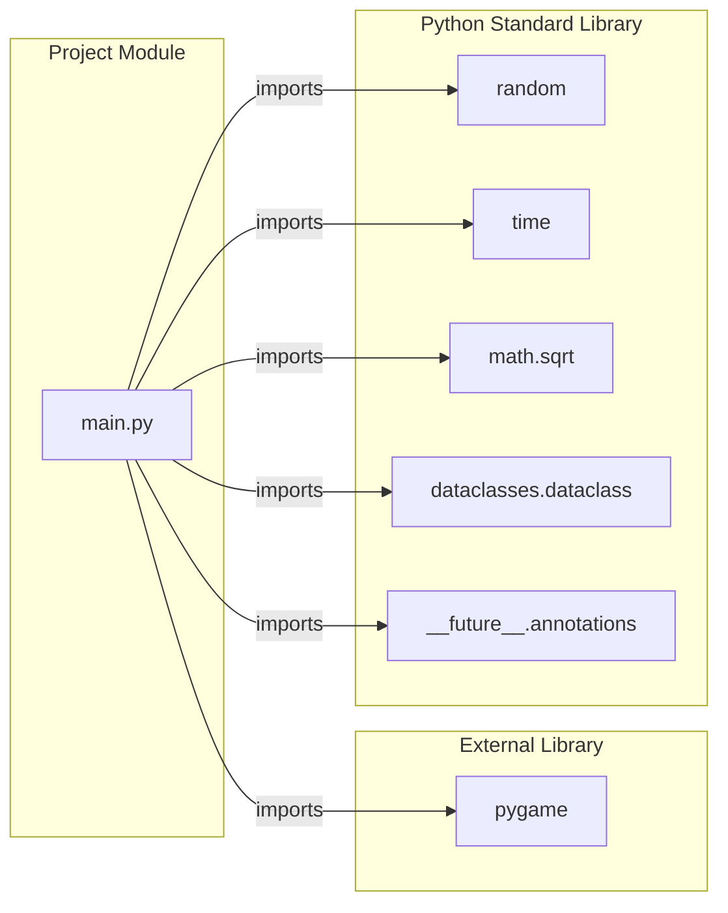
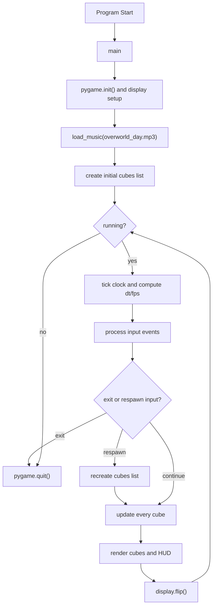
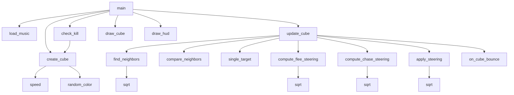
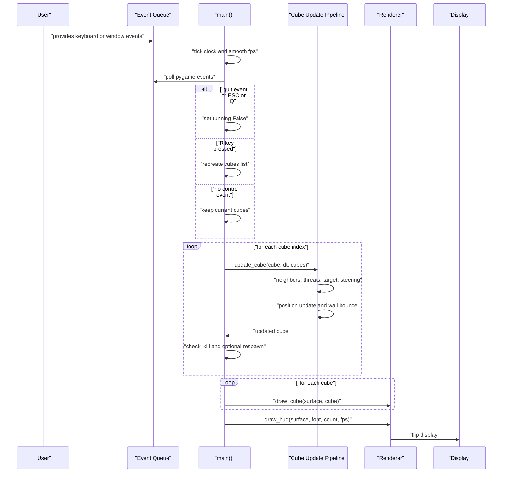

# Project Architecture

## Scope
This architecture is derived from the current implementation in `main.py`.
The project is a single-module pygame simulation of autonomous moving entities (`Cube`).

## Module Dependency Graph

## High-Level Runtime Flow

## Function-Level Call Graph

## Primary Execution Sequence (Main Loop)

## Key Architectural Notes
- Single-file architecture: all domain logic, rendering, and runtime orchestration are in `main.py`.
- Update pipeline is deterministic per frame order, but entity behavior is stochastic due to random initialization and bounce damping.
- Entity replacement strategy uses lifespan expiration (`check_kill`) to keep simulation population stable.
- Extension hooks exist (`on_cube_bounce`) for future side effects such as sound, score, or effects.
